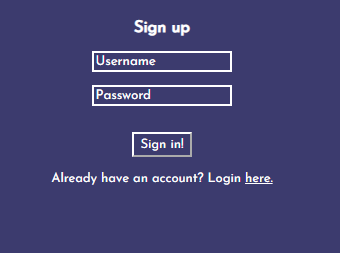
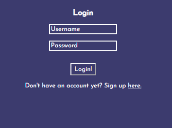
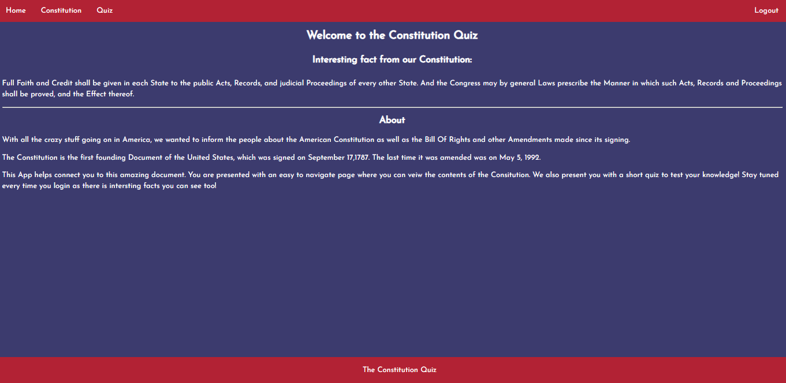
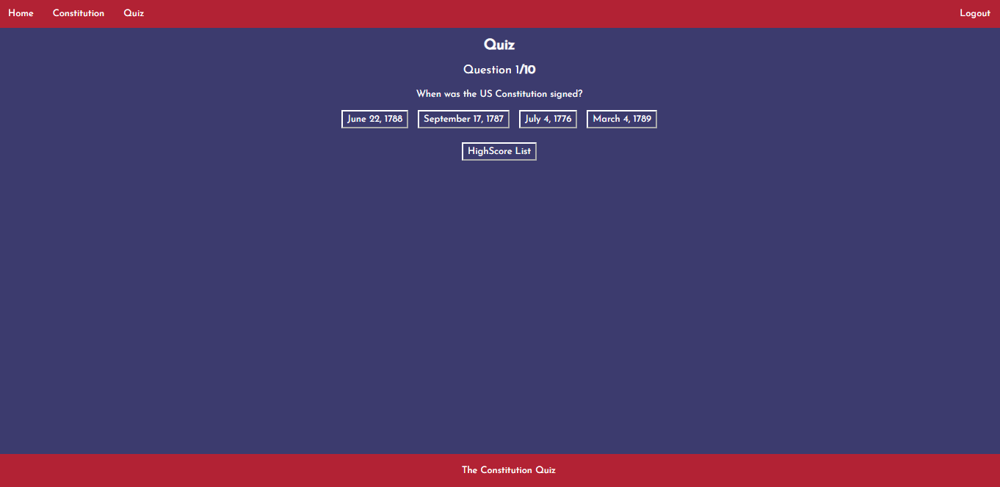
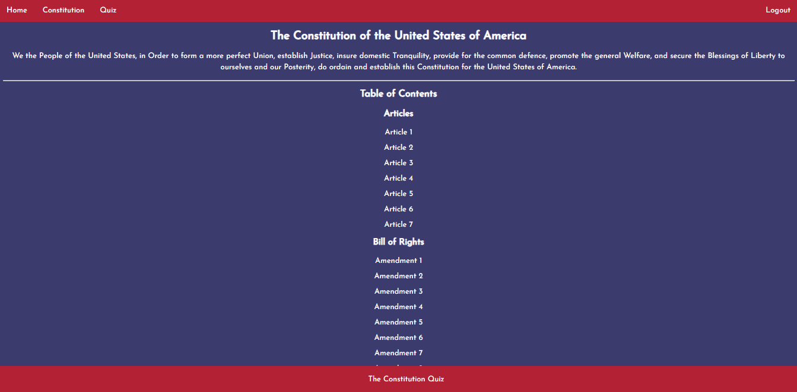

# Elevator Pitch: Constitutional Quiz App

## Description:
Our app provides users with a resource they can use to improve their understanding of American civics and political history. Our motivation for creating this app was a desire to help regular Americans improve their knowledge of basic American civics in a fun and engaging way.

### Table of Contents
[Installation](#installation)
[Usage](#usage)
[Contributing](#contributing)
[Tests](#tests)
[Questions](#questions)

#### Installation
In order to get our app up-and-running, we built a React.js web app that uses React-Modal, Lodash, Bcryptjs, Express, Morgan, Axios, Mongoose, and Passport.

#### Usage
In order to use our app, all a user needs to do is open our deployed app in [Heroku](https://constitutionquiz.herokuapp.com/). Once they have arrived there, they need to sign up for an account and then login using their login credentials.
 

When they have logged in, they will arrive at the Home page, which contains an interesting fact from the Constitution (which changes each time the page is refreshed) and our "About" section.

The user can then go to the Quiz page, take the 10 question quiz, and see (1) their highest score, (2) their current score, and (3) all their previous scores;

or they can go to the Constitution page, where they can read the Constitution, the Bill of Rights, and the Amendments to the Bill of Rights.

#### Contributing
This was a collaborate team effort. Grant setup Server.js and deployed our app to Heroku; Baker wrote the code for our Authentication process, setup our routes, and connected our local app with Mongoose (while we were testing the app); Paul created our quiz; Lucas debugged our app throughout our build process; and I setup the MVC folder directory, and created our Components, Pages, and overall styling.

#### Tests
We tested our app by troubleshooting all issues at the local level, and while our app was connected using Mongoose. Once we had built a finished product, we then deployed the app to Heroku and connected it with MongoDB Atlas.

#### Questions
If you have any questions, please feel free to reach out to Baker (bakerquil), Grant (grantf12), Lucas (LucasWinslow), or myself (HHH-603).
